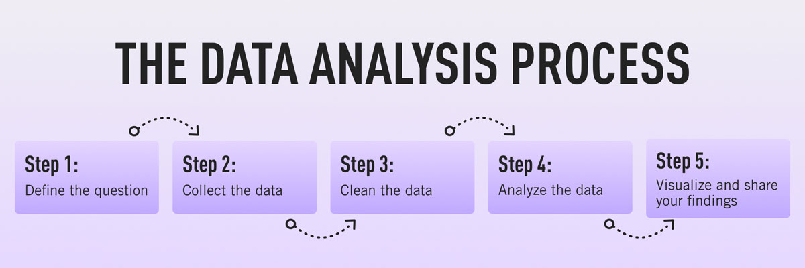

# Google Data Analytics Certification Capstone Project

This project was done as the capstone project for the course.

As was discussed through the course, there are 5 main steps in the Data Analysis Process. They are:

---

## Defining the Question

There are 2 questions I try to address through this project. They are

1. **Is there a correlation between how an episode "feels", and its rating?**

2. **Is there an observable correlation between the overall dramaticity of an episode and the subsequent episode's view count?**

To make the problem statement as subjective as possible, the term "feel" is taken as a combination of the average polarity and subjectivity of each line of dialogue, for each character. 

Similarly, we measure the "drama" in an episode by taking the mean and standard deviation of polarity and subjectivity of each episode, for each character.

---

## Collecting the Data

To answer the two questions, we require Finallyall episode transcripts, their ratings, and total viewers that tuned into the episode live. 

Dataset sources:

1. [Screenplay](https://www.kaggle.com/datasets/blessondensil294/friends-tv-series-screenplay-script)
2. [Ratings](https://www.kaggle.com/datasets/rezaghari/friends-series-dataset)
3. [Viewership](https://www.kaggle.com/datasets/ruchi798/friends-tv-show-all-seasons-and-episodes-data)

---

## Cleaning the Data

Given that the screenplay is just text files and the ratings and viewerships are in different CSV files, information from these three sources needs to be cleaned and merged together for any meaningful use.

First, all script files are parsed and stored in a CSV file in the format
`Season, Episode, Title, Speaker, Dialogue`

Next, we extract 

`Season, Episode, Stars, Votes`

from the ratings sheet, and

`Season, Episode, U.S. viewers`

is extracted from the viewership sheet.

Using `S-E (Season - Episode)` as a common key across all three sheets, we end up with 2 final tables:

1. dialogues.csv `S-E, Speaker, Dialogue`
2. metadata.csv `S-E, Viewers, Stars`

Notebook for data cleaning can be found [here](preprocessing.ipynb)

---

## Analysing the Data

First, preliminary EDA is carried out on the two datasets. This can be found [here](EDA.ipynb).

Next, sentiment and polarity analysis is carried out on the scripts dataset, to test the hypothesis. This can be found [here](analysis.ipynb).

---

## Share Findings

**Inferences**:

- There is a positive correlation between the viewership of an episode and its overall rating.

- Season 2 had the highest consistent viewership, while Season 6 had the lowest.

- Season 4 was the highest consistently rated season, while Season 1 was the lowest.

- The main 6 (Ross, Rachel, Chandler, Monica, Joey and Phoebe) spoke most of the dialogue (92.6%).

- "Oh my God" and "I don't know" are the most common trigrams.

- The top 10 tri and tetragrams across the main 6 is very similar.

- There is an overall weakly positive correlation **(0.1848)** between the "feels" of an episode and its rating.

- There is an overall weakly positive correlation **(0.2651)** between the "dramaticity" of an episode and the subsequent episode's viewership.

Visualisations for the same can be found [here](analysis.ipynb)

---

## Conclusion

The answers for the initial questions are:

1. **Yes, there seems to be an overall positive correlation between the "feels" of an episode and its rating.**
2. **Yes, there seems to be an overall positive correlation between the "dramaticity" of an episode and the subsequent episode's viewership.**
